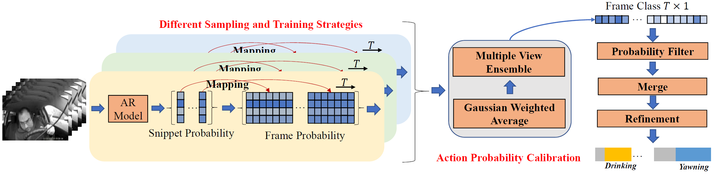

This repo is the solution for 7th [AICITY](https://www.aicitychallenge.org/2023-challenge-tracks/) (2023) Challenge Track 3 - Naturalistic Driving Action Recognition.


## Running environment

Please refer to the [INSTALL](Train/INSTALL.md) to prepare the running environment.

## Preprocessing
Please run command below to go into the preprocessing folder:
```bash
cd Preprocessing
```
First, download the training data and annotation files, which are provided by the 2023 AICity Challenge. Then put the downloaded data in **YOUR_DATA_PATH**.
As there exist some errors in the official annotation file 'user_id_86356.csv', we recommend replacing it with our modified files in [Preprocessing/A1_new_annotation](Preprocessing/A1_new_annotation).
Next modify the __data_homepath__ parameter in [Preprocessing/cut_video.py](Preprocessing/cut_video.py#L31) and [Preprocessing/create_csv.py](Preprocessing/create_csv.py#L6) as your own data path.

After finishing the preparations above, run the commands below to cut the original long training videos into meaningful segments (It needs about 04 hours.):
```bash
python cut_video.py
```
Then, generate the training files (*.csv) by running:
```bash
python create_csv.py
```
Finally, the total structure of YOUR_DATA_PATH should be the same as follows:
>   * YOUR_DATA_PATH
>     * A1
>       * user_id_*
>         * CAMERAVIEW_user_id_*.MP4
>         * user_id_*.csv
>       * ...
>     * A1_cut_video
>       * new_spllit_by_id_A1_total
>         * expand_zero
>           * train_dashboard.csv
>           * val_dashboard.csv
>           * test_dashboard.csv
>           * ...
>         * original_zero
>       * 0
>         * *.MP4 
>       * 1
>       * ...

## Train
It needs 2 RTX3090 GPUS ( totally 48G ) to perform the training experiments.
First, run this command to go into the training folder.
```bash
cd Train
```
Then download [X3D_l weights](https://dl.fbaipublicfiles.com/pyslowfast/x3d_models/x3d_l.pyth) pretrained on kinetics-400 and put it in [Train/pretrain](Train/pretrain).
In the [Train/exp/aicity3](Train/exp/aicity3) folder, there are experiment folders to train all of our used models.
To train a model, you should first specify the **DATA.PATH_TO_DATA_DIR** in the **run.sh** files as your path (should be YOUR_DATA_PATH/A1_cut_video).

Then please run:
```
CUDA_VISIBLE_DEVICES=[your_GPU_indexes] bash exp/aicity3/[EXPERIMENTS_FOLDER]/run.sh
```
The training results are in the  **EXPERIMENTS_FOLDER**, the structure of which is shown as follows:
>   * EXPERIMENTS_FOLDER
>     * checkpoint_[VIEW]_[TRAIN_MANNER]_zero
>       * checkpoints
>         * checkpoint_epoch_000**.pyth
>         * ...
>       * stdout.log
>       * ...
>     * run.sh
>     * config.yaml

We use the weights of the last epoch to predict the snippet-level action probabilities.


## Inference
### General folder structure for Inference
Please put the videos to be tested in the **YOUR_TEST_DATA** folder. And organize the folder as follows:
>   * YOUR_TEST_DATA
>     * user_id_*
>       * CAMERAVIEW_user_id_*.MP4
>       * CAMERAVIEW_user_id_*.MP4
>       * CAMERAVIEW_user_id_*.MP4
>       * ...
>     * video_ids.csv
### Reproduce (also suitable for custom videos)
To reproduce our results on the public leaderboard of AICity 2023 Challenge, we recommend directly downloading the **_checkpoint_submit.zip_** in [Google Drive](https://drive.google.com/drive/folders/1ZqcT_Z3rqEXrTSe3k_WpYpmhHBPAgnCF?usp=sharing). It includes all the checkpoints of different training manners, camera views, and sampling strategies. 
You can also run all the experiments in the [Train/exp/aicity3](Train/exp/aicity3) folder. But it will cost much more time and you should also rename the pretrained checkpoint _checkpoint_epoch_000**.pyth_ to the format _TRAINMANNER_VIEW_frame*_rate*.pyth_.

After downloading all the checkpoints, please put them into the [Inference/checkpoint_submit](Inference/checkpoint_submit) folder.
Then organize the A2 dataset provided by the 2023 AI City Challenge as mentioned structure above.

After finishing the preparations above, please run the command below to go into the inference folder:
```bash
cd Inference
```
There are two steps in the inference process. First, to generate snippet-level action probabilities by running (please replace YOUR_TEST_DATA with the specific data path):
```bash
python generation_probability.py --cfg configs/Kinetics/X3D_L.yaml NUM_GPUS 1 TRAIN.ENABLE False DATA.PATH_TO_DATA_DIR [YOUR_TEST_DATA]
```
The generated results are in the [Inference/probability_results](Inference/probability_results) folder. Then run the command below to generate the final submission files.
```bash
python inference_finalresult.py --cfg configs/Kinetics/X3D_L.yaml NUM_GPUS 1 TRAIN.ENABLE False DATA.PATH_TO_DATA_DIR [YOUR_TEST_DATA]
```
The generated submission files are saved in the [Inference/output](Inference/output) folder.

#### Quickly reproduce our results on public leaderboard
If you want to reproduce it quickly, you can download the **probability_results.zip** files from [here](https://drive.google.com/drive/folders/1ZqcT_Z3rqEXrTSe3k_WpYpmhHBPAgnCF?usp=sharing). After downloading, please unzip and put these files in ./probability_results. Then run the following command.

```bash
python inference_finalresult.py --cfg configs/Kinetics/X3D_L.yaml NUM_GPUS 1 TRAIN.ENABLE False DATA.PATH_TO_DATA_DIR [YOUR_TEST_DATA]
```


## Acknowledgement

This repository is built based on [UniFormerv2](https://github.com/OpenGVLab/UniFormerV2) and [Winner of 2022](https://github.com/VTCC-uTVM) repository.


